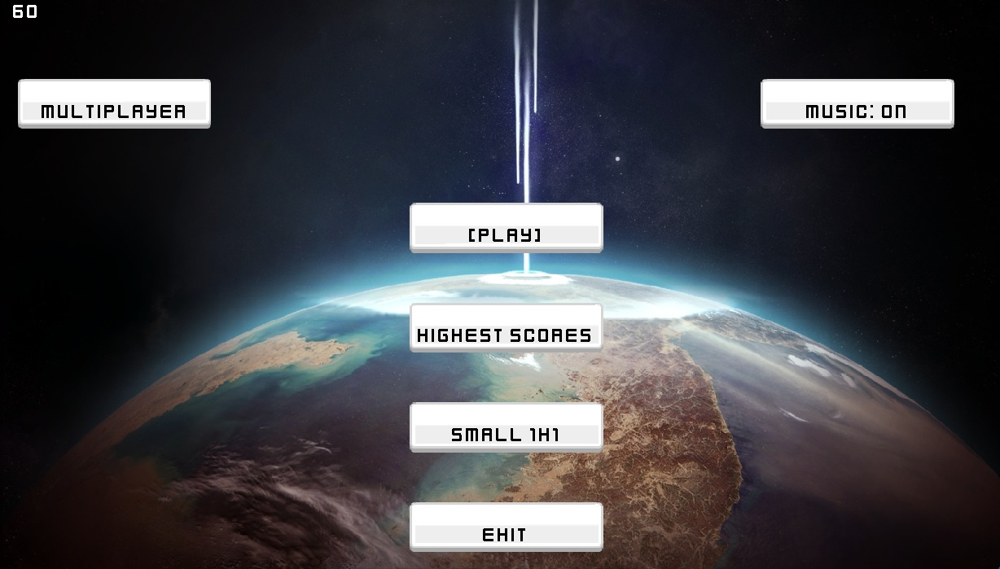

# PROYECTO MAYHEM

<!-- TABLE OF CONTENTS -->
<details>
  <summary>Table of Contents</summary>
  <ol>
    <li>
      <a href="#-about-the-project">About The Project</a>
      <ul>
        <li><a href="#-built-with">Built With</a></li>
      </ul>
    </li>
    <li>
      <a href="#-getting-started">Getting Started</a>
      <ul>
        <li><a href="#-prerequisites">Prerequisites</a></li>
        <li><a href="#-installation">Installation</a></li>
      </ul>
    </li>
    <li><a href="#-usage">Usage</a></li>
    <li><a href="#-roadmap">Roadmap</a></li>
    <li><a href="#-contributing">Contributing</a></li>
    <li><a href="#-license">License</a></li>
    <li><a href="#-acknowledgments">Acknowledgments</a></li>
  </ol>
</details>


<!-- ABOUT THE PROJECT -->
## ❓ About The Project 

Desarrollo de un juego 2D de aeronaves basado en el conocido retro **Asteroids** para PC con multiplayer lan desarrollado 
en lenguaje Java como solucion a trabajo integrador de la materia Ingeniería en Software. La base del proyecto se realizará
a partir de un [tutorial](https://youtube.com/playlist?list=PLHwsL1JI79K1CIS9P3Ik9ilOzMyYKElfG) para aprender acerca de desarrollo de 
videojuegos en Java y se irán implementando nuevas mecánicas y modos de juego originales, al mismo tiempo que se aplican los 
conceptos vistos en clase de metodologías ágiles, control de versiones, testing, continuous integration 
y continuos deployment (CI/CD), entre otros.


<p align="right">(<a href="#top">back to top</a>)</p>

### ⚙️ Built With

* [Java](https://www.java.com)
* [Gradle](https://gradle.org/)


<p align="right">(<a href="#top">back to top</a>)</p>


<!-- GETTING STARTED -->
## 🏁 Getting Started

### 🚩 Prerequisites 

- Install [java JRE](https://www.java.com/es/download/ie_manual.jsp)
- Install [java JDK 11](https://www.oracle.com/ar/java/technologies/javase/jdk11-archive-downloads.html)

### 🔧 Installation
This option is suitable if you want to try the game.

1. Visit our  [releases](https://gitlab.com/facu4/proyect_mayhem/-/releases) page in gitlab and 
download the latest version of the game. You can download the executable .jar file or the source code in a .zip file.

### 🔨 Compiling the Code
This option is suitable if you are introducing new features.

1. Clone the repo
   ```sh
   git clone https://gitlab.com/facu4/proyect_mayhem.git
   ```
2. If you are using intellij open the project as a gradle project.
3. Using gradle you can compile de code and generate a .jar file.
   ```sh
   ./gradlew assemble
   ```
   It will create a .jar file in the folder build/libs.
4. You can run the game using the .jar file.
5. You can also run the game executing the main class in the package src/main/java/main/Window.java


<p align="right">(<a href="#top">back to top</a>)</p>


<!-- USAGE EXAMPLES -->
## 🔥 Usage
### Menu de juego

### Juego


<!-- ROADMAP -->
## 🚗 Roadmap

- [x] Asteroids
- [x] Name Selector
- [x] Big Maps
- [x] LAN multiplayer

See the [open issues](https://gitlab.com/facu4/proyect_mayhem/-/issues) for a full list of proposed features (and known issues).

<p align="right">(<a href="#top">back to top</a>)</p>


<!-- CONTRIBUTING -->
## 👥 Contributing

Contributions are what make the open source community such an amazing place to learn, inspire, and create. Any contributions you make are **greatly appreciated**.

If you have a suggestion that would make this better, please fork the repo and create a pull request. You can also simply open an issue with the tag "enhancement".
Don't forget to give the project a star! Thanks again!

1. Fork the Project
2. Create your Feature Branch (`git checkout -b feature/AmazingFeature`)
3. Commit your Changes (`git commit -m 'Add some AmazingFeature'`)
4. Push to the Branch (`git push origin feature/AmazingFeature`)
5. Open a Pull Request

<p align="right">(<a href="#top">back to top</a>)</p>

<!-- LICENSE -->
## 📒 License

Distributed under the MIT License. See `LICENSE.txt` for more information.

<p align="right">(<a href="#top">back to top</a>)</p>


<!-- ACKNOWLEDGMENTS -->
## ✨ Acknowledgments

* [Gitlab](https://gitlab.com)
* [Gradle](https://gradle.org/)
* [Java](https://www.java.com)
* [Jacoco](https://www.eclemma.org/jacoco/)
* [Game Networking](https://www.youtube.com/playlist?list=PLvPPkch7E3t3GtccgGhFgtRxp6dyIAWvx)
* [Juego Base (videos)](https://youtube.com/playlist?list=PLHwsL1JI79K1CIS9P3Ik9ilOzMyYKElfG)
* [Juego Base (Repo)](https://github.com/JoshuaHernandezMartinez/SpaceShipGame/tree/master)

<p align="right">(<a href="#top">back to top</a>)</p>